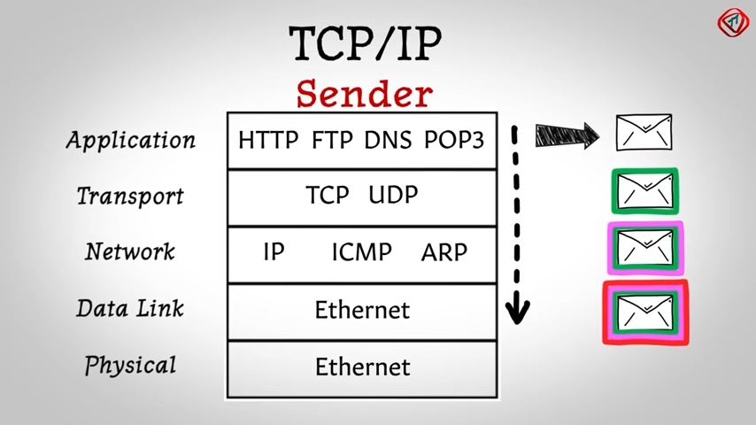
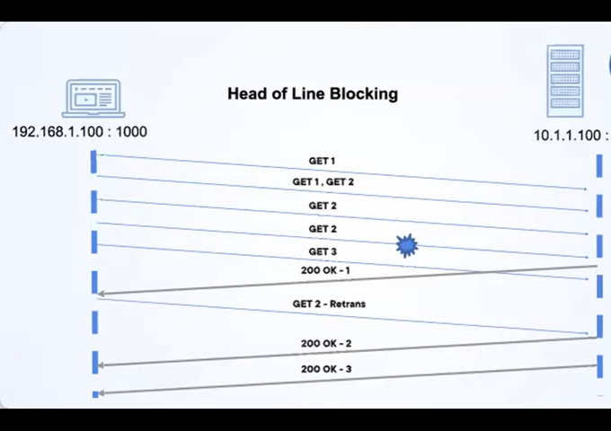
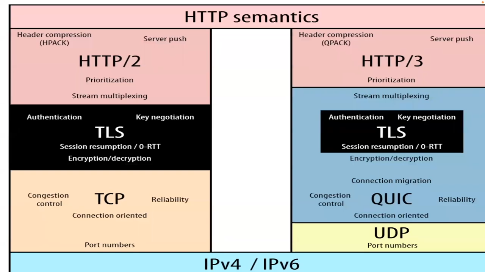
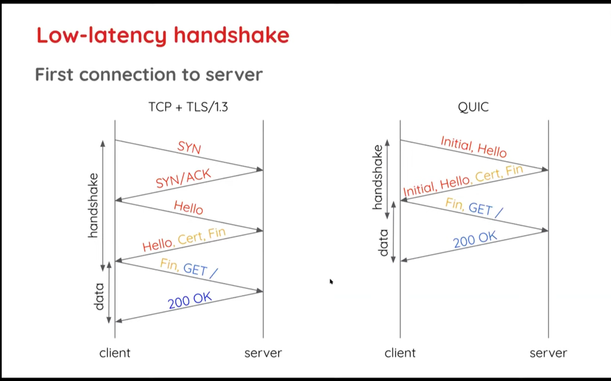
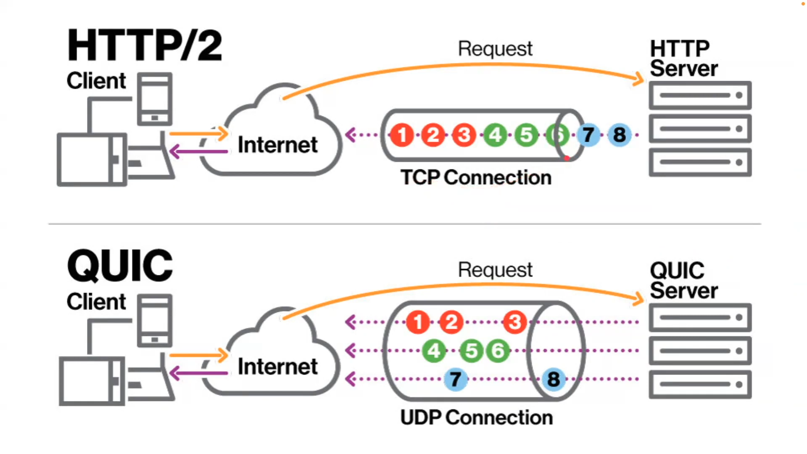
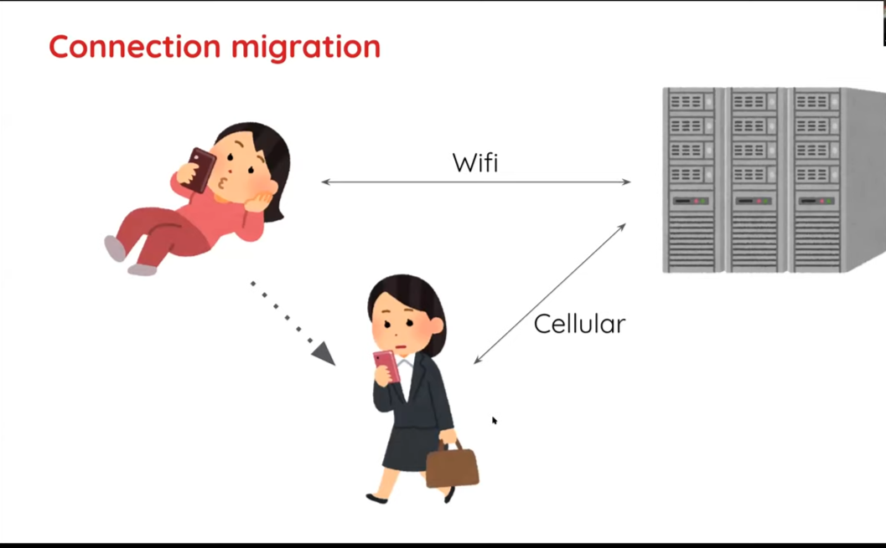

# HTTP/3 QUIC - The Intorduction

This blog introduces you to the world of QUIC and HTTP/3. The challanges it solves, the thought process behind the solution and the solution it self.
I shall also discuss why HTTP/2 is not going anywhere and is here to stay.

Yes, inspite of new innovations, your applications need to support HTTP/2 for a forciable future.

## In layman's terms what is QUIC?

QUIC (Quick UDP Internet Connections, pronounced quick) is an experimental transport layer network protocol designed by engineers at Google.
Both HTTP/1 and HTTP/2 use TCP as the underlying transport layer network protocol. TCP has been around for ages since the Internet became a mainstream technology. As a green field technology, it was mainly built to *achieve* a *transport layer's* functionality, but not so much *optimize* it. In short, TCP is not the most efficient transport layer you could have.

That led to innovation of QUIC, and to implement HTTP over it. And some tweaks are made to HTTP/2 to roll out HTTP/3.

## Where we are with HTTP/2 - Network Protocol Stack

Network protocols are a set of rules, followed by all the parties on a network, to provide reliable and safe communication. You can think of them like the programs on your PC that let you tell the PC what to do clearly and accurately. Similarly, a network protocol makes sure both communicating end-points (and the intermediaries) are on the same page.

Just like with programs, *modularisation* of network protocols is a great way to make them reusable and modifiable with less effort. So, we break down a network protocol into multiple *layers* and pile them into a *stack*. Each *layer* provides a specific function and interacts with its nearest layers.

So, we have the *transport layer* that ensures **reliable** traffic on the Internet. TCP serves this function in HTTP/2, and QUIC does it in HTTP/3. We also have an *encryption layer* to keep the communication **secure** using TLS. You can look at the infographic below to see the build up of the TCP/IP network protocol stack.

### Two Sources of Inefficiency with TCP

A couple of inefficiency causes in TCP are:

#### 1. Head Of Line Blocking

TCP transports multiple files as a **single byte stream** or **"big file"** over the Internet. The problem is if this byte stream loses some data packets during transit, **the entire byte stream with all the files is resent**. We call this Head of Line (HOL) blocking in jargon.

#### 2. Inefficient Handshake

Remember, we said transport layer needs to ensure **reliable and secure** connections. One key aspect of this includes the server and the client identifying each other accurately when communication begins. So, networks use a **handshake** between the two end-points to ensure everything is in order before sending the data over HTTP. You can think of handshake as an exchange of few bytes of data to verify the identity.

This handshake takes one full trip from the client to the server and back to complete. This **RTT (Round Trip Time)** can reach up to 200 milliseconds for some networks before you even *start* sending an HTTP request. Clearly, not very good news if you want a fast **first paint** (the time at which the first data shows up on your site or app).

### The other part of challange - The internet today.

When our applications access data over Internet, the request travels through many **middleboxes**.

So, building a new transport layer means these **middleboxes** need to be upgraded.

Hence, the new transport layer can not be built from scratch.

The clever engineers at google overcame this challange building QUIC on top of another existing and widely supported network layer, **UDP**.

### So why is HTTP/2 here to stay?
Meet the **firewalls**. Firewalls, although not tightly integrated into the internet infrastucture, have been widely adpoted.
For an avg internet user, there was very little / no need to use the UDP protocol. Hence, most firewalls block UDP by default and treat it as (essentially) unsolicited network traffic.

The same problem of mass updates applies to firewalls as well. 

### UDP - The Unsung Hero Behind HTTP/3

**UDP or User Datagram Protocol** is what we would naively think of a *protocol* . It is just a bare-bones protocol that shifts data packets from point A to B without any added bells or whistles. UDP provides no handshakes, no packet loss retransmission and is obviously unreliable. But, the trade-off for these features makes UDP blazing fast.

But *it's speed* is not why QUIC uses UDP. Remember, the original problem with QUIC is to have a transport layer which can be loaded with the *middleboxes*. As, UDP has been around for ages, *most of the middleboxes already support UDP*!

So, as we on-board the new QUIC on top of the already supported UDP, there are no pesky firewalls ruining our data packets. Bingo, we got ourselves a **brand new efficient transport layer**!

### QUIC - A Deep Dive

So, now that we have undertood how QUIC was made widely deployable, we only needed to make it an "efficient version of the old TCP".

And that is what QUIC is. QUIC is an efficient transport layer because:

- **It reimplements most of the old TCP features in a better way**. QUIC picks up crucial learnings from years of TCP deployment to redo its features in a better and more efficient way. For example, just like TCP, QUIC also uses **handshakes**, **acknowledges data receipts**, and **retransmits lost data** but it optimizes these features.
- **QUIC adds some new features to inline itself with the modern tech landscape**. QUIC does support new features like **multiplexing independent byte streams**, **HOL Blocking Solution Mechanisms**, **connection migration** and **secure by default**.

Let's quickly run through these features:

### Secure By Default

QUIC is built with the modern **secure by default** approach. You cannot have QUIC without TLS. QUIC encrypts everything.

Two key pay-offs of this approach:

- **A QUIC handshake combines the transport layer handshake and the security handshake into one that completes over a single RTT**. With HTTP/2 and earlier, there were 2 (or 3 for TLS 1.2 and earlier versions) RTTs for the two different TCP and TLS handshakes. It makes HTTP/3 faster.

  

- **QUIC also encrypts packet meta data** which means, the middleboxes cannot read the meta info, and *cannot accidentally break the network* even if they have old versions or some hard-to-trace bugs! This welcomed side-effect makes QUIC and HTTP/3 easily deployable to an Internet scale.

### Head Of Line Blocking Solution

QUIC multiplexes different files into one but recognizes **independent byte streams**. In short, even though it rolls many files into a single package, it identifies them individually. So, if you lose a packet from file A, QUIC will still transport files B and C in the original byte stream. It will only retransmit file A. It is a nice efficiency feature.

### Connection Migration

With HTTP/3, you can't continue on the same connection when you switch networks - for example, from Wi-Fi to a cellular network. Connection migration cuts down one RTT required for a new handshake. This improves performance.

### Frames

TCP has one header for all its meta data. QUIC optimizes this by breaking down different pieces of meta information into separate frames. It puts only the frames, a packet needs and not the full header which optimizes. And even more, **you can extend QUIC with new frames and meta info** easily compared to the old HTTP/2. As you will see below, the ability to evolve QUIC(kly) is one of the most promising features of HTTP/3.

###  The Not-So-Quick Fix - QUIC - A Nuanced Reality

Sorry to break it to you, but just like life, the new QUIC has a nuanced reality. Computer networks are complex and many factors are at work. Some of them even outdo each other at times.

So, sadly many of the new  QUIC and HTTP/s features do not provide as much efficiency and security gains as we would expect. It is best to take the new promises with a pinch of salt as we do not want to go down the same road of misplaced expectations as with HTTP/2.

### The QUIC Take-Away

However, QUIC and HTTP/3 have a few **clear-cut positives** to them:

- **HTTP/3 and QUIC will deploy at Internet scale and evolve rapidly**

The wide support for UDP is a sure-shot winner for HTTP/3. So, HTTP/3 will deploy at scale and thus be ready for new breaking changes. 

Also, much development effort in QUIC happens in the user space and open source community. Contrast this with TCP,  which comes from an OS kernel origin and only a select group of niched developers work on it. So, there will be extensive experimentation and sharing on QUIC in the community.

It means QUIC will quickly update with **new network algorithms and practices**. So, it will be better going forward, and this is its real USP. It's features might not provide much gain right now, but will improve network performance as they evolve.

- **QUIC and HTTP/3 are already better than the old TCP-HTTP/2 Combo for Mobile Devices**

TCP has its origins in the pre-mobile era. QUIC, on the other hand, is built for the modern technology landscape. Some QUIC features, for example, connection migration and the proposed Multipath, are tailor made for mobile networks. Apple already has native QUIC and HTTP/3 support for its Safari browser from iOS 14 onward, and for apps outside the browser from iOS 15 onwards. You can also integrate cronet in your Android apps to use HTTP/3, and the support is only going to get better with time.

- **QUIC and HTTP/3 already show significant gains for users on slow networks**

As we said above, some of QUIC's new features do not show significant gains due to inherent network complexities. But, the silver lining is that these features do provide marked performance improvements on slow networks. So, HTTP/3 will give you a leap ahead for your users having slow internet speed. Also, for your users over long network calls, say those over satellite networks, QUIC and HTTP/s will help you.
