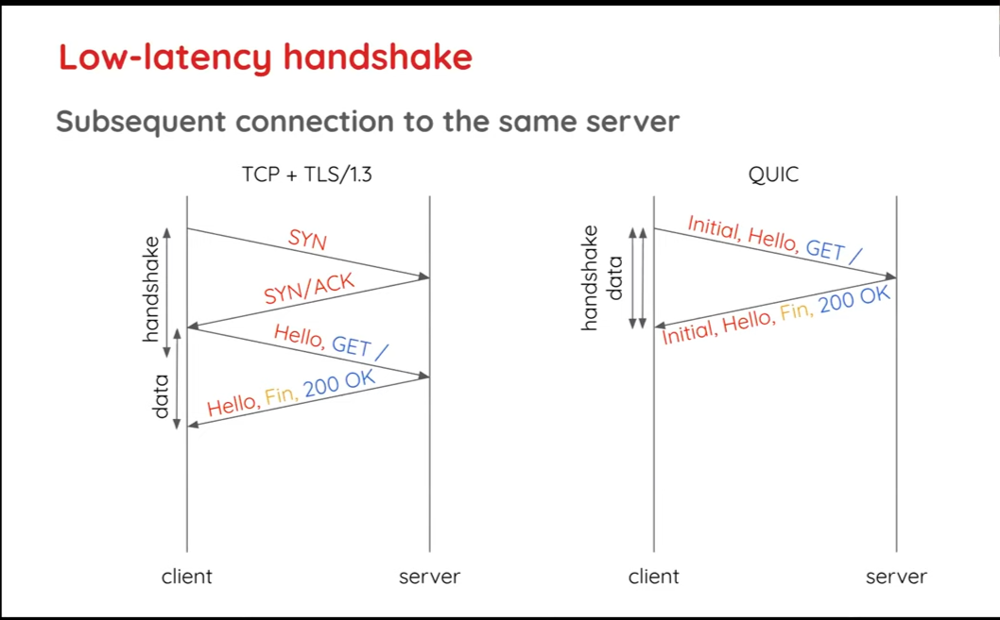
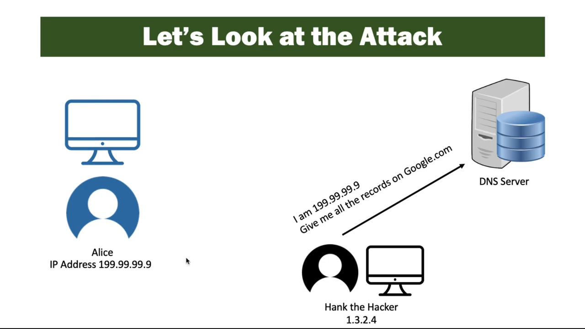

# QUIC and HTTP/3 Features - Secure by Default and Fast Connection Setups

The new QUIC packs in some exciting new features to provide superior network performance. We will have a deep dive into one of these features in this blog post.

### QUIC New Features Caveat 

Before we get into the nuts and bolts of QUIC, we advise you to take its new features with a pinch of salt. Complex network realities and multiple opposing forces undermine some of these features in some use cases. As such, the speed and security gains are not as big as we expect **currently**.

However, QUIC has the advantage of evolving quickly. So, as new algorithms and optimizations roll out, the gains would also improve with time.

## Secure By Default Approach - Deep TLS Integration

QUIC closely integrates with TLS in sync with the modern **secure by default** approach to information risks. You cannot have QUIC without TLS. Period.

QUIC encrypts everything you send over it. Encryption over QUIC differs from encryption over TCP and TLS in two major ways:

- **QUIC also encrypts meta data such as packet headers and also the transport layer information**

  This means that the middle boxes can never read much into what data goes through them over QUIC. So, they cannot even accidentally crash a packet even if they run older versions of the protocol as they never read the meta info!

- **QUIC encapsulates TLS into itself. So, everything on QUIC is encrypted**. 

  This naturally makes QUIC a safer protocol than TCP/TLS.

  ## QUIC Secure By Default Pay-Offs

  ### Performance Impact - Faster Connections

  When you setup a new connection, networks use a **handshake** between the end-points to identify them correctly, and to make sure both are ready to communicate before sending over actual HTTP data.

  With the older HTTP/2 and HTTP/1.1 , we need two separate handshakes:

  - **A TCP Handshake ( or the transport handshake)** This takes one **RTT ( or Round Trip Time - It is the time for one trip from the client to the server and back over the actual physical connections)**. 
  - **A TLS (or the security handshake) Handshake** This takes one RTT for TLS 1.3 and 2 RTTs for TLS 1.2 and earlier versions. 

  HTTP/2 and earlier versions only send the first HTTP data after this trips complete. Your client then shows the **first data paint (the first data on the client side)** after this HTTP RTT completes. So, you need to wait for either **3 (for TLS 1.3)** or **4 (for TLS 1.2 and prior)** before you display your first response data. 

  QUIC combines both the security handshake and the transport handshake into one. This saves one RTT for the initial connection set-up than with the TCP-TLS pair. So, with QUIC, you can get **your first paint in 2 RTTs**. 

  For fast networks with RTTs of the order of 50 miliseconds, this might not be much. But for users on **slow networks** in poor countries or **long networks** over satellite calls, you get significant performance gains.

  

  However, we can be clever and optimize the connection setups.

  ### Optimizing QUIC Connections

  #### Session Resumption

  As the initial handshake RTTs cause load delays, we can be clever and **encrypt subsequent connections** without the completion of the handshakes.

  Users often revisit websites within a reasonable time span. We setup the first connection in the normal way. But during this first session, we send some encryption key values for the second connection. Then, if the user revisits the site within the set time span, we can **encrypt the second session before the handshake completes**. We call this technique **session resumption**.

  #### o-RTT

  We can now do one better and **send HTTP data with the first request itself for the second session**. 

  We can thus cut down the RTT delays for the handshakes and get our **first paints quicker for second session onwards**. We call this technique **o-RTT**.

  

  ### QUIC - A Nuanced Reality

  Sadly, real-world network complexities make QUIC a nuanced reality. So too for its optimized connections.

  #### QUIC Connection - Amplification Attack

  An attacker could make an o-RTT request but **spoof the victim's IP address** as the requesting address and send the response to it! QUIC can't detect such an attack as the o-RTT request has no handshake to verify the client identity! 

  So, the attacker could crash the victim's network by directing large responses from the server this way. We call this an **amplification attack**.

  

  ​

  

  To prevent this, QUIC limits o-RTT response data to only **3 times the size of the client's request data**. But, this cuts down some of the gains that o-RTT could bring. Most client early requests are just a packet or two long, so the o-RTT response could be mostly about 4-6 KBs, which is pretty low.

  #### QUIC Connection - Replay Attack

  A black-hat hacker can intercept a message and resend it multiple times to deceive a victim into doing something that benefits the attacker at the victim's cost. As the attacker uses the original encrypted message to resend it, it appears genuine. 

  It is obvious that such **replay attacks** are very easy over o-RTT requests. So, QUIC limits the kinds of o-RTT requests you can make. For example, some implementations only let you make GET o-RTT requests without query parameters. Again, this security measure again cuts down the potential speed benefits of o-RTT by limiting its use cases.

  ### QUIC Connections With In-Built Security - The Take-Away

  Hence, QUIC is **secured by default** approach is a mixed bag when it comes to **fast connection setups**. 
  Most users will only see minor performance gains. 
  But, users on slow networks or those with low initial data volumes like cached websites and single pages will see marked speed improvements.

  ### Scaling Impact - Easily Deployable

  QUIC's inherent encryption makes it easily deployable at scale. As middleboxes cannot read much into the QUIC data or meta data that goes through them, compatibility is much less of a problem. You might have older versions on the middle box devices, but they won't break the network as the QUIC packets are essentially black boxes to them!

  ### Security Impact - Robust Security

  Finally, with TLS deeply ingrained into it, QUIC everything you send over it. So, you reduce loop holes for attackers to plug in and eavesdrop or crash client/server machines.

  However, when you pick a stick, you have to pick both its ends. QUIC's always-on security approach has few costs as well.

  ## QUIC Secure By Default Downsides

  ### Firewalls

  As network middleboxes cannot read into the data or the meta-info QUIP sends over it, some network administrators may get wary of potential security risks. They may setup strict firewalls and disallow QUIC per se. So, we might never see QUIC present *everywhere* on the Internet. 

  But, once again, as QUIC lies on the cutting-edge of evolving network technology, we will see adoption on a good-enough scale as practices and algorithms improve.

  ### Encryption Costs

  UDP is the most stripped-off network protocol you can find. It essentially only transports data packets between end-points at fast speeds. 

  TCP builds on this naive implementation and adds critical features like reliability and packet loss recovery. Naturally, it is slower than UDP for the new features costs.

  QUIC beefs up this *transport layer* functionality further by integrating the *security layer's* encryption features by default. These added overheads make QUIC slower than TCP.

  ​

  ​

​	